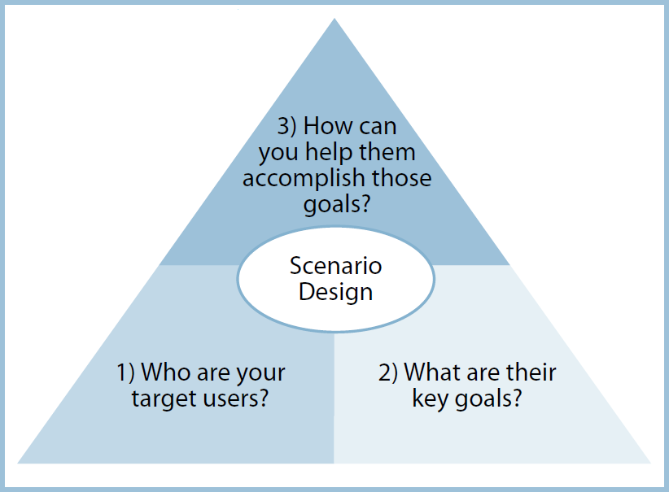

```{r setup, include=FALSE}
knitr::opts_chunk$set(echo = TRUE)
```

#Discussion 11: Recommender Systems

###INSTRUCTIONS

Your task is to analyze an existing recommender system that you find interesting.  You should:

Perform a Scenario Design analysis as described below.  Consider whether it makes sense for your selected recommender system to perform scenario design twice, once for the organization (e.g. Amazon.com) and once for the organization's customers.
Attempt to reverse engineer what you can about the site, from the site interface and any available information that you can find on the Internet or elsewhere.
Include specific recommendations about how to improve the site's recommendation capabilities going forward. 
Create your report using an R Markdown file, and create a discussion thread with a link to the GitHub repo where your Markdown file notebook resides.  You are not expected to need to write code for this discussion assignment.
Here are two examples of the kinds of papers that might be helpful backgrounders for your research in #2 above (if you had chosen amazon.com or nytimes.com as your web site):

Greg Linden, Brent Smith, and Jeremy York (2003): Amazon.com Recommendations:  Item-to-Item Collaborative Filtering,  IEEE Internet Computing. 
Alex Spangher (2015): Building the Next New York Times Recommendation Engine


####How to Perform a Scenario Analysis (review)

Scenario Design is an easy-to-use “three question framework” that helps you in making sure that the information in your analysis work takes UX (user experience) into account:



Source: “Scenario Design:  A Disciplined Approach to Customer Experience,” Bruce D. Temkin, Forrester Research, 2004.  Temkin notes that before applying Scenario Design, one might ask, “What functionality should we offer?”  After applying Scenario Design, one might instead ask, “What user goals should we serve?”

Your task is to:

Identify a recommender system web site, then
Answer the three scenario design questions for this web site.  
This process of guessing/reverse engineering, while inexact, will help you build out your own ability to better account for “user needs” in designing recommender systems going forward.  Being able to place the customer first in your mind is a “soft skill” that is highly valued in the technical marketplace.

You may work in a small group on this discussion assignment!  Please make your initial post (which includes a link to your GitHub hosted R Markdown file before our meetup on Wednesday, and provide feedback to at least one of your class mates’ posts before end of day on Sunday.  Your feedback should include at least one additional reference and/or constructive suggestion.


# Travel Recommender Systems (TRS)

*Definition:*
Travel recommender systems are tools and techniques used in the provision of suggestions (recommendations) about travel destinations and other important factors to a traveller or a potential traveller. 

*Objective:*
These recommendations are aimed at helping the user (traveller) find and make a decision on a travel destination within certain limitations such as budget and travel time (vacation days).

*System fuctionality:*
Most travel recommendation systems utilize a knowledge base constructed using user preferences and and use statistics. This enables the algorithms in the system to retun personalized and customized replys or solutions to user queries.

 
# System evaluation 

Evaluation of recommender systems is based on their accuracy of recommendations. Huge variances between the recommendations and user interests may lead to loss of confidence of the user in the system and lead to loss of the customer for good.


# Recommendations

To ensure success in the use of recommendation systems, there is need to use the right form of language interms of compatibility of the human to machine dialogues to the extent that even a naive user can effectively user the system.
 
# Conclusion

Recommender systems can bring about efficiencies and effectiveness and b extension lead to reduced costs to the travellers (users) which would ensure that they can afford to travel within the limitations mentioned above on both budget and travel time available.

Effective recommender systems could also increase sales and sales revenues for the various providers, thus ensureing profitability and by extension continued service provision to travellers.


### The intested reader can read the articles below for information on further utilization of recommender systems.

[1] A Modified Approach towards Tourism Recommendation System with Collaborative Filtering and Association Rule Mining. Monali Gandhi, Khushali Mistry, Mukesh Patel. International Journal of Computer Applications.
[2]  F. Ricci and H. Werthner, “Case-Based Querying for Travel Planning Recommendation,” Information Technology and Tourism, vol. 4, nos. 3–4, 2002, pp. 215–226.
[3] Joseph A. Konstan, John Riedl. Deconstructing Recommender Systems: How Amazon and Netflix predict your preferences and products you purchase. IEEE Spectrum, Sept. 2012


#Sources

http://eutravelproject.eu/knowledge/content.aspx?id=39

https://www.cognizantsoftvision.com/blog/travel-recommender-systems/

https://www.researchgate.net/publication/332151806_A_Survey_of_Travel_Recommender_System

https://bbhosted.cuny.edu/bbcswebdav/pid-2023603-dt-forum-rid-347480650_1/xid-347480650_1 
https://bbhosted.cuny.edu/bbcswebdav/pid-2023603-dt-forum-rid-347480651_1/xid-347480651_1 


